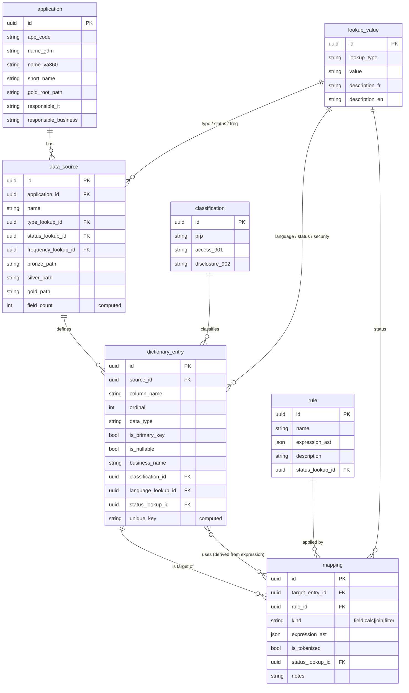
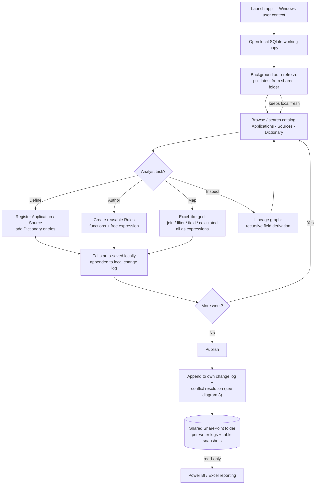
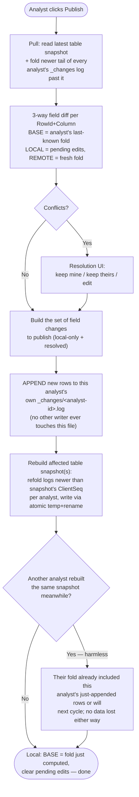

# Data Mapping & Lineage App — Diagrams

> Companion to the project reference. Three Mermaid schemas: the **normalized data model**,
> the **user workflow** once the app is built, and the **publish / conflict-resolution flow**.
> Names follow the normalized convention introduced in the architecture doc (§4 normalization pass):
> snake_case technical identifiers; French/business names live as catalog labels.
> Diagram 3 reflects the **per-writer append-only log** design (architecture §6a) — each analyst
> publishes by appending to their own file, never a shared one.

---

## 1. Data model (normalized ER)

Domain entities + the typed lookup and classification reference tables. Meta tables
(`column_catalog`, `audit_log`, `app_config`) are described below the diagram since they apply
generically to every table.

**Meta tables (generic, not drawn above):**
- `column_catalog` — `(id, table_name, column_name, data_type{scalar|reference|computed}, label_en,
  label_fr, reference_target, formula, is_required, is_user_added, display_order)`. **Describes every
  table** and drives the dynamic UI editors. Folded the same way as any other table (§6a).
- `audit_log` — `(change_id, change_set_id, table_name, row_id, column_name, old_value, new_value,
  operation, changed_by, changed_at, client_seq)`. **Not a separate write target** — it *is* the
  deterministic fold of every analyst's own `_changes/<analyst-id>.log` (architecture §6a/§8); a
  materialized `audit_log` snapshot is kept for fast reads, same as any other table.
- `app_config` — `(key, value, scope{local|shared})`. Runtime settings (canonical path, remote format,
  refresh interval, locale). `local` rows never sync.

Every domain row also carries sync metadata `(row_version, modified_at, modified_by, is_deleted)`
and governance `(status_lookup_id, revised_at, revision_ref, notes)`. `row_version` is a local
edit counter (fast unchanged-row skip); conflict detection is per-cell against each analyst's
last-known fold, not a table-level version (architecture §6a/§7a).

---

## 2. User workflow (once built)

---

## 3. Publish / conflict-resolution flow

> Revised for the **per-writer append-only log** design (architecture §6a/§7a): an analyst's
> publish only ever *writes to their own log file*, so there is no shared file to lock or race —
> conflict detection still happens, but against a computed fold, not a contended file.

**Why there's no lock and no CAS retry here:** the only file an analyst ever writes
authoritatively is their **own** log — appends to *different* files never collide, so the
classic git-style "did the remote move while I was writing" race simply doesn't apply to the
canonical data. The **only** shared-write hazard left is the **snapshot rebuild** (a read-mostly
optimization), and that race is self-healing: whichever rebuild loses just means the next
auto-refresh or publish folds the missed increment in, because the underlying logs are never
overwritten or lost — only the derived snapshot lags briefly.

